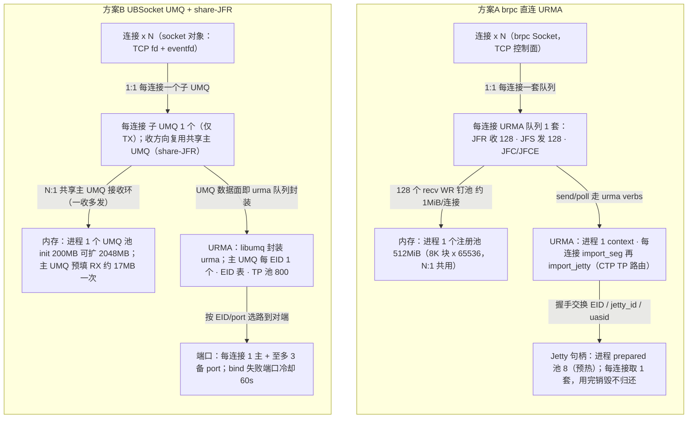

# UBSocket(ubs-comm) vs brpc urma_transport 分支 —— 特性与能力对比报告

- 快照：`ubs-comm` master 工作树（`src/ubsocket`，UBSOCKET_VERSION=0.1.0） vs `brpc` `urma_transport` 分支工作树（Apache brpc + URMA 传输，BRPC 版本线 1.17.0）。
- 方法：两棵代码树的代码级深潜（子代理逐文件通读 + 本人抽样核实），所有关键主张均带 `文件:行号` 证据；文档/AGENTS 声称与代码不符处已单独标注。

---

## 0. 一句话定位（最根本的差别）

| | UBSocket（ubs-comm，当前实现） | brpc urma_transport 分支 |
|---|---|---|
| 本质 | **用户态 POSIX socket 加速库**：在 **fd 层**模拟 `socket/connect/accept/readv/writev/epoll_*`，对上层应用（含 brpc）透明；南向实际走 **UMQ**（本仓 src/hcom/umq）——**UMQ 本身即直接构建在 URMA SDK 之上的封装**（内部持有/调用 urma context/jetty/jfr/jfc/tseg 全套，见 §8.0），即**已对接 URMA**；代码树内另有直连 URMA 的绑定层（`dl_urma_api` ~125 函数指针 dlopen `liburma` + `urma_wrapper` 完整 Device/Context/Jetty 封装 + `urma_backend` 初始化，真实调用、非 stub）；未完成的是把 URMA 作为**不经 UMQ 的独立 socket 后端**接入主数据面（`UrmaSocket` 仍为抽象空壳） | **brpc 框架内的第四个 Transport 插件**：`SOCKET_MODE_URMA=3`，brpc Channel/Server 直接**调用 openEuler URMA SDK**（URMA_TM_RM Jetty + CTP），数据面全 URMA，控制面 TCP |
| 面向 | 任何用 socket API 的应用（字节流、POSIX 语义）；"well integrated with bRPC" 靠的是**在外侧替换符号/拦截 fd**，本仓不含 brpc | baidu_std RPC 服务/客户端（协议级）；用户只需设 `socket_mode`，brpc 上层（命名服务、负载均衡、Socket 生命周期、bthread）全部复用 |
| 成熟度 | v0.1.0（Major=0）；经 UMQ 的 URMA 数据通路可用；**直连 URMA（不经 UMQ）的独立后端未交付**；大量 POSIX 桩缺口 | 分支级新特性，可编译、有 UT+mock、双语文档齐全，但无指标、无端到端测试、资源管理粗糙 |

> 由此派生几乎所有差异：UBSocket 的能力词典是 **fd/POSIX/逃生/版本协商/维测 CLI**；brpc 分支的能力词典是 **Transport/协议协商/框架复用/零拷贝池**。

---

## 1. 总览对比表

| 能力维度 | UBSocket 0.1.0（当前代码） | brpc urma_transport 分支 |
|---|---|---|
| 建链控制面 | 真实内核 TCP fd + 应用层 length-prefixed 字节流协商（magic `0xff52504341445054` 8B + 版本 4B + NegotiateReq/Rsp/Route） | brpc Socket 建 TCP fd，fd 上跑 URMA 握手（v2 二进制 "URMA" 86B / v3 protobuf "URM3" 11 字段） |
| 版本协商 | **有**：`UBSVersion` 位域 Major6/Minor12/Patch14；Major 不一致→双方降级 TCP；Minor/Patch→取低继续；跨版本 body 长度自适应（RecvLengthPrefixed） | **无**：v2/v3 仅靠 flag `--urma_client_handshake_version` 选择，客户端遇 v2-only 服务端退化为 TCP 而非降 v2 |
| URMA/UB 使能协商 | 无（UMQ 后端固定）；有 NATIVE_TCP_MODE 进程级透传 + 单连接 degrade | 三态 `URMA_UNKNOWN→ON/OFF` + 4B ACK(`HELLO_ACK_URMA_OK=0x1`) 共识；任一不对齐→软回退 TCP（字节推回 `_read_buf`） |
| 双向互操作 | UBSocket 服务端可直接服务纯 TCP 客户端；客户端连纯 TCP 服务端仅"设计层"成立（协商字节需清流） | TCP 客户端↔URMA 服务端透明回退（闭环）；**URMA 客户端→纯 TCP 服务端不回退**（无 magic 识别方） |
| 保序 | 数据面=字节流无应用分帧；24-bit 环形 seq（探针占用 0xFFFFFF）；**RM_CTP 模式有显式 OOO 重排（堆）+ gap/超时熔断**；其余模式完全信任底层按序 | brpc 层**无序号/无重排/无重传**，完全委托 URMA RM+CTP 内核按序；只保证单写者提交序、按完成序喂字节流 |
| 流控 | UMQ 底层 credit（initial16/max256）+ 每 socket TX 窗口 `tx_queue_avail_num_`；EMLINK/ENOBUFS→TP 池等待队列（背压）；写无资源=返回 0+EAGAIN | 双窗口原子信用流控（先扣后发，上限≈min(sq,peer_rq)−3≈125 条×8KB）；信用经独立 `SEND_IMM` 空包回补；EAGAIN→butex 阻塞 |
| 零拷贝 | TX iov 直指用户 8K 对齐 Block + IncRef（不拷贝）；RX 缓存 Block 切割后接到 brpc 给的 block 链上 | 512MB mmap+单次 `urma_register_seg` 切 8KB 块，**劫持全局 IOBuf 分配器**；收 ≥512B 走 cutn 零拷贝；用户内存 `RegisterMemoryForUrma` |
| DFX | profiling 58 打点（fast/ext P50-P999）、per-socket SplitTrace、KPI JSON、UDS CLI 9 命令、probe RTT、SIGUSR2 dump、errno 四类转换 | 仅日志 + per-socket Debug(/connections) + gflags；**无新增 bvar** |
| 逃生/主备 | 声称 UB↔Eth 自切换/主备；代码=降级摘 fd 透传裸 TCP + 一主三备路由重试 + 端口冷却(60s)，无热切验证 | URMA→TCP 软回退；bonding（active-backup/balance，provider 扩展 `urma_ubagg.h`）已实现 |
| 许可/构建 | Mulan PSL v2；CMake+Bazel；加固 flags 齐全（-Werror/-fstack-protector-strong 等）；UMQ 默认直连、dlopen 备选 | Apache-2.0；CMake/Make/Bazel 三套；`BRPC_WITH_URMA` 门控，无硬件用链接期 mock |
| 测试 | 118 用例（converter/纯逻辑），行覆盖 ~15%/分支 ~7%；无数据面/连接级 CI | 单测覆盖 wire 格式/校验/mock API；**无端到端**（状态机/回退/窗口未自动化） |

---

## 2. 建链（重点轴）

### UBSocket（三阶段，全在 UMQ 后端）
1. **fd 阶段**：`socket(AF_SMC)`→建真实 TCP fd + eventfd；`connect/accept` 走 libc；
2. **协商阶段**（真 TCP 上 length-prefixed 字节流）：
   - 握手模式二选一：`TCP_UB_SOCKET_HANDSHAKE`(UB_SOCK_OPT，值 144) 或 **TFO**（`sendto(MSG_FASTOPEN)` 携带 magic+版本+NegotiateReq；无 cookie 自动换 fd 重试）；
   - 版本协商：Major 不一致→**双方降级 TCP**（发 mismatch_version 后精确丢弃残留 body，避免污染后续 brpc 读 fd）；Minor/Patch→取较低者；
   - 路由协商：FULLMESH_1D 单路 RR / CLOS 光组网按 CPU 亲和选主备（一主三备），`EidRegistry` 缓存 RR index；绑定 bonding 一致性校验；
   - `DoUbConnect/DoUbAccept`：交换 bind_info → `umq_bind` → RX prefill（PrefillRx 预投满 rqe_post_factor×rx_depth）→ share-JFR 下把主 UMQ RX interrupt fd 注册进 SHARE_JFR_RX EpollRunner；
   - ack 状态机 `kSTART→kOK/kRETRY/kDEGRADE/kFAILED`：可重试→换路由重建 UMQ 再 bind；degrade→从 ArraySet 摘 fd 后走裸 TCP（逃生）；
3. **资源阶段**：share-JFR（默认开）建"主 UMQ 只 RX + 子 UMQ 只 TX"双句柄；TP 池（默认 800 transport）预热、每 tp 的 TX interrupt fd 注册 runner。
- 控制面超时 `CONTROL_PLANE_TIMEOUT_MS=200s`；端口冷却 60s；失败统一走 `umq_errno_converter` 四类映射。
- **关键事实**：`SocketState` 的 RAW_ESTABLISHED/ESTABLISHED 生产代码几乎不写（建链成功状态一直停在 INIT）——状态机属遗留。

### brpc urma_transport（双平面）
1. brpc 既有 TCP connect/accept 建 fd（`acceptor.cpp`/`socket.cpp` DoConnect），建链回调拉 `UrmaConnect::StartConnect`（客户端）/服务端由 TCP 首字节 edge 回调触发；
2. fd 上握手：客户端 `C_ALLOC_RES→C_HELLO_SEND→C_HELLO_WAIT→C_IMPORT_PEER→C_ACK_SEND→ESTABLISHED`（服务端对称）；先预投 JFR（PostRecv）再发 hello；
3. `import_seg` 必须先于 `import_jetty`（否则首 SEND 被硬件以 `URMA_CR_RNR_RETRY_CNT_EXC_ERR` 拒）；v3 protobuf hello 携带 11 字段（EID/jetty_id/uasid/tp_type/扁平化 seg）；
4. 4B ACK 共识置 URMA_ON/OFF：客户端发 ACK 即 ON；服务端三分支（ack_ok&&!OFF→ON；ack_ok&&OFF→EPROTO 硬错；!ack_ok→回退）；
5. 软回退：magic 不是 "URMA/URM3"、校验失败、资源失败→**字节推回 `_read_buf` + 切 TCP 处理**（应用无感）；hello 非法=EPROTO 断连；
6. 建链后 TCP fd 仅保 epoll 生命周期/EOF：再收字节即 `SetFailed(EPROTO,"Unexpected TCP data")`；重连走 brpc `WaitAndReset`→transport Reset；
7. 预分配 jetty 池（默认 8，随 RLIMIT_NOFILE 自动截断）加速建链；握手 IO 每次 50ms butex_wait、**无总超时**（靠上层 RPC 超时）。

**对比结论**：UBSocket 的建链复杂度（双 UMQ 句柄、多平面路由、亲和、版本协商、逃生策略、200s 超时）远高于 brpc 分支；brpc 把连接生命周期/重连/超时交给框架，URMA 层只做"协商+切数据面"，因此更干净，并具备**对称的 magic 级自动回退**。UBSocket 独有：**进程级 NATIVE_TCP_MODE**、**版本协商降级**、**TFO 握手**、**端口冷却**。brpc 独有：prepared jetty 池、v3 protobuf 握手、URMA↔TCP 硬回退闭环（服务端侧）。

---

## 3. 保序（重点轴）

### UBSocket
- 数据面**字节流**，无消息边界；writev 可部分成功；readv 按需切 block 链喂给 brpc；
- 每 WR 分配 24-bit 环形 seq（`FetchAddSeqNum`，CAS 环形加减；探针包占用 `0xFFFFFF`）；整批 post 失败/部分失败均回退 seq；
- **乱序处理（仅 RM_CTP 使能）**：`UmqBufferReceiveQueue` 用 FastHeap 按环形 seq 小序重排；`gap>MAX_WINDOW(一半模数)`→判重复/超期直接释放；gap 超 `max_ooo_gap(min(128,rx_depth))` 或超时 200ms→**熔断**：整个 OOO 堆推入主队列、expect 前进到"最后收到 sn+1"（断链跳号后以"收到即有序"强制前进，不丢数据）；
- 非 RM_CTP（RM_TP/RC_TP）不做任何序号校验，完全信任底层；
- share-JFR 下主 UMQ RX 上多连接交织，先按 `buf_pro->umq_ctx`(fd) 分发到 per-socket 队列，**再按连接粒度重排**；
- 流控：发送窗口 `tx_queue_avail_num_`(UBS_TX_DEPTH)，CQE 回收后恢复；底层 UMQ credit（initial_credit=16/max=256/min_reserved=2）；TP 池资源不足（EMLINK/ENOBUFS）→ socket 进 `UmqTpWaitQueue`，等 TRANSPORT_POOL_EVENT_RUNNER 事件唤醒；
- **写背压语义特殊**：`Writable()` 假 → **返回 0 + errno=EAGAIN**（给 brpc 的"无资源"信号，非阻塞业务可能误判为成功 0 字节）。

### brpc urma_transport
- brpc 层**无任何显式保序**：无序号/无重排/无重传，完全委托 URMA_TM_RM(可靠消息)+CTP 内核路径——**隐含假设"内核按序交付"**（代码与文档均无显式机制）；
- brpc 侧只保证：单写者提交序（`StartWrite` 用 `_write_head.exchange` 串行化 post）、按完成序回收缓冲、按 poll 序 append `_read_buf` → `DispatchReceivedBytes`（dispatch_mutex + ESTABLISHED 门）串行喂 InputMessenger；
- **双窗口原子信用流控**：`_local_window_capacity = min(sq, peer_rq) − 3`（默认 sq/rq=128 → 约 125 条在途，每 WR ≤ 对端 buffer_size≈8KB，大消息跨多 WR）；post 前先扣两窗口（防轮询模式完成先于 post 返回导致的瞬态超窗），失败回加；
- 信用回补：收方 PostRecv(1)+攒 ACK（>remote_capacity/2 才 flush 一条 `SEND_IMM` 空包，imm_data=重投 recv WR 数）；发方收到 IMM 信用 CAS 加窗并校验上界；SQ 完成低水位（remote_rq≥cap/8）唤醒写者；
- 完成错误一律 EIO→整连接 SetFailed（**靠重连而非重试**）；RNR/err_timeout 超限即连接失效；
- 事件模式（JFCE fd 包成第二个 Socket，edge 回调 `urma_wait_jfc→urma_poll_jfc(≤32)→ack→rearm`）与轮询模式（每 tag `urma_poller_num` 个 bthread 忙轮询）双实现。

**对比结论**：两边都把**底层有序可靠交付**委托给 RM/CTP，且都有"先扣后发"的窗口式信用流控与完成驱动回收。差异点：
- UBSocket 在 socket 层**额外实现了显式乱序重排+熔断**（面向 RM_CTP），并保留 24-bit seq（兼探针识别）——对"底层偶发乱序/断链跳号"更主动；
- brpc 分支零显式处理，纯粹依赖 URMA；一旦 URMA 出现乱序，brpc 侧没有防线；
- 背压语义不同：UBSocket 用"0+EAGAIN"（贴合 brpc 非阻塞约定但违背 POSIX），brpc 用 Transport 层 EAGAIN→butex 阻塞（标准 Transport 语义）；
- UBSocket 把信用/流控沉在 UMQ 底层（socket 层不可见），brpc 把信用显式放在传输层（sq/rq 双窗口可观测、可配 `--urma_sq_size/--urma_rq_size`）。

---

## 4. DFX（重点轴）

| DFX 能力 | UBSocket 0.1.0 | brpc urma_transport |
|---|---|---|
| 打点/剖析 | ProfilingTPId 58 项（含 BRPC_CLIENT_CALL/READV/WRITEV 等 8 个 BRPC_* 点位供 brpc 复用打点）；fast 模式计数/sum/min/max（pp90 未实现，TODO），ext 模式按 CPU 采样 + 蓄水池(1024) + P50/90/95/99/999 | **无新增 bvar/打点**（urma 源 grep bvar 零命中），仅复用 socket 通用计数器 |
| per-连接链路 trace | SplitTrace（write/read/epoll 三组 double-buffer，默认 65535 条，drain 10ms 线程）；**编译宏在整树未定义→发行构建内为空转** | Transport::Debug→DebugInfo（state/sq/rq/窗口/handshake_version），经 brpc /connections 端点暴露；GetStateStr 14 状态 |
| 统计/KPI | 进程级计数器（连接/收发包/重传/丢包…）→ **KPI JSON**（10s 一行 append 到 /tmp/ubsocket/log，10MB 归档） | 无（靠上层 brpc bvar/示例 LatencyRecorder，example 自带非库内） |
| 运维 CLI | **UDS CLI**（\0ubscli-<pid>）：stat/topo/delay/fc/qbuf/umqinfo/io/umq/probe 9 命令 + watch；服务端 GlobalStatsMgr 线程 | 无（brpc 用 /vars /status /connections 内置服务） |
| 连通性探测 | ProbeManager 1s 周期发 probe 包（user_data=0xFFFFFF）测 RTT，8 时间戳统计 | 无（URMA 侧无等价探测） |
| 日志 | Logger 单例 + 外部钩子 `ubsocket_set_logger`（同时桥接 umq 底层日志）；无 brpc 日志代码 | LOG/WARNING/ERROR 丰富（握手失败带 state/reason、post 失败带 jetty/窗口/bad_wr 全上下文、初始化 INFO 带设备参数） |
| 信号 | SIGUSR2 → ObjectStatistics dump 日志 | 无 |
| errno | 四类转换器（统一表 15 条 + savedErrno override + HandleResult + 方向三表 connect/accept 17、writev/readv 各 24），91 个单测 | URMA 错误统一 EIO（无 status 细分），RPC 错误码沿用 brpc |

**对比结论**：UBSocket 的 DFX 体系**明显更重、面向"维测"**（独立 CLI、KPI 文件、probe、逐 fd SplitTrace、SIGUSR2），但**多数默认关闭或需重编译**（SplitTrace 无编译宏、profiling/CLI/KPI 默认关或受 env 门控），且存在多处实现缺口（pp90 未实现、CLI -e 无效、计数器只在 UBS_TRACE_ENABLED 下更新等）。brpc 分支 DFX 极简（日志 + Debug + gflags），**可观测指标完全缺位**——但它站在 brpc 生态上（/vars、rpcz、内置服务现成，只是本分支没接 bvar）。**两边在"传输自带可观测性"上都不足**；若目标是量产运维，UBSocket 的 CLI/KPI/probe 形态更接近需求，但需要修门控与缺口；brpc 侧最该补的是 bvar 化指标。

---

## 5. 商用/产品化条件（重点轴）

### UBSocket 0.1.0
- **版本与兼容策略**：协议号=软件版本（0.1.0）；Major 不一致→双方降级 TCP（无线上互通承诺），Minor/Patch 取低——**v0.x 阶段无任何线上协议承诺**；
- **测试/质量门禁**：118 个 TEST_F（converter 91 / connector 21 / signal 5 / profiling 1），行覆盖 ~15%、分支 ~7%（目标 ≥80%/≥50% 远未达成）；UT 只覆盖纯逻辑，**数据面与 epoll/连接级路径无 CI**；AGENTS 记载的多套 stub（fake_epoll/AllocMockBufWithBlock/SocketTestHelper）与 3 个 binary **在当前树已删除，文档漂移严重**；
- **POSIX 语义缺口（商用硬伤）**：`send/recv/read/write/sendto/recvfrom/sendmsg/recvmsg/sendfile/sendfile64/accept4` 共 11 个桩**无条件返回 0**（违反 POSIX）；`fcntl/fcntl64/ioctl/sendmsg` 连 NATIVE_TCP_MODE 守卫都没有（TCP 模式也返回 0，静默失败）；epoll_pwait 忽略 sigmask；writev 无资源返回 0+EAGAIN（非阻塞误判风险）；uninit 不可重入（不置 UBS_INITED=false、不释放 g_zcopy_allocator）；close 递归风险取决于符号部署（导出名是 `ubsocket_close` 而非 `close`，裸 LD_PRELOAD 并不能拦截 close —— README 的透明劫持语义悬空）；
- **直连 URMA 的独立数据通路未交付（≠ 未对接 URMA，详见 §8.0）**：数据面经 UMQ 即跑在 URMA 上（UMQ 底层=urma context/jetty/jfr/jfc/tseg，真实 UMDK 头文件），故"UBSocket 对接 URMA"成立；此处未完成的是把 URMA 作为**不经 UMQ 的独立 socket 后端**——无 SOCK_TYPE_URMA 枚举、工厂只有 UMQ 分支、EpollRunner 无 URMA ops、`UrmaSocket` 是含纯虚函数的抽象空壳（不可实例化）、`urma_setting` 空壳、`urma_backend` 可独立 urma_init 但无产品调用方（仅 tools/golden 的 conn/show 消费）、`urma_wrapper` 完整但仅被 golden 引用；默认构建不编译 core/urma（BUILD_URMA_DLOPEN_BACKEND=OFF，因默认后端直连 libumq）；
- **文档/发布**：顶层 RELEASE-NOTES 只讲 HCOM，无 UBSocket 条目；README 的 OS/URMA 依赖留空（USER-GUIDE 才给出 openEuler 24.03-sp3 + TaiShan 950 SuperPod）；Overview 宣称的 Eth 自切换/热主备无代码对应；
- **工程纪律**：Mulan PSL v2；release 加固 flags 齐全（-fvisibility=hidden/-fstack-protector-strong/-Werror/-Wl,-z,noexecstack,relro,now/-fPIE/-D_FORTIFY_SOURCE=2）；CMake+Bazel；UMQ 直连为默认、dlopen 为可选（dl_umq_api 存在 5 个声明未 dlsym 的潜伏问题，非默认路径）。

### brpc urma_transport 分支
- **协议面**：仅 baidu_std（白名单），SSL/RTMP/NSHEAD/MONGO 在 ContextInitOrDie 拒绝；服务端无白名单（非 URMA 协议可经 TCP 回退服务）；互操作：TCP 客户端↔URMA 服务端闭环回退、反向不回退；**v2/v3 无版本协商降级**；
- **依赖/平台**：Linux/openEuler + UMDK 头 + liburma + UB/CTP 硬件（无硬件时 CMake/Make/Bazel 均可用链接期 mock 编译+单测，`URMA_USE_MOCK=AUTO/ON/OFF`、真库时 GTEST_SKIP）；bonding 需私有头 `urma_ubagg.h`；
- **测试**：单测覆盖 v2/v3 序列化、magic 分发、ACK 位、ValidHello、CTP priority、baidu_std 白名单、mock smoke（init/枚举/context/双向 send-recv+imm）——**无状态机全流程/回退/窗口闭环/Channel-Server 端到端测试**；
- **文档**：docs/cn/urma.md + en/urma.md（195/209 行）与代码核对一致；**urma_proposal.md 是提案，与实现有 5 处偏离**（SEND_WITH_IMM piggyback vs 实际 SEND+SEND_IMM 独立空包；复用 rdma block_pool vs 自建池；dlopen liburma vs 链接；prepared 池 RESET 回收 vs 一次性；mock 不搬 payload vs 实际搬运）——评审须以代码为准；**CHANGES.md 无任何 urma 条目**；
- **不成熟点（均有代码证据）**：
  1. 无 bvar 指标（§4）；
  2. 池耗尽→回退 malloc 的 block 不可 URMA 发送→**发送硬错误 ERDMAMEM 断连**（非背压）；
  3. prepared jetty 一次性、无回收；
  4. 全局 IOBuf 分配器劫持与 RDMA 并存互斥**未校验**（进程级副作用大）；
  5. 握手无总超时（50ms 无限循环）；
  6. 服务端"URMA magic + hello 非法"直接 EPROTO 断连、不降级；
  7. 单连接内大小包混合（SOCKET_MODE_HYBRID_UB_URMA）、URMA-SHM、GPU 内存注册等提案 Phase2/3 项未实现；
- **工程纪律**：Apache-2.0；CMake/Make/Bazel 三套构建；示例 urma_performance（--use_urma 对照、warm-up、bvar 报表）缺 Makefile/BUILD（仅 CMake）；urma 源零 TODO/FIXME。

**对比结论**：两者都处于"预商用/孵化"阶段，但**阻断点性质不同**：
- UBSocket：商用前需先补 POSIX 语义（11 个返回 0 的桩 + fcntl/ioctl 守卫）、打通符号替换部署语义、补齐数据面/连接级测试、给出发布说明与依赖清单；**以 URMA 为独立后端（不经 UMQ）的"第二传输"未交付**（当前 URMA 对接经 UMQ 通路实现），且版本 Major=0 无协议承诺。
- brpc urma_transport：作为**分支级新特性**已具备可用雏形（建链/回退/流控/零拷贝/双文档/mock CI），商用化需补 bvar 指标、池耗尽背压化、prepared 资源回收、握手总超时、端到端测试、CHANGES 维护；集成在成熟框架上（重连/超时/协议栈/运维服务都现成），**推进阻力主要在 URMA 硬件可用性与资源管理鲁棒性**。

---

## 6. 其他相关特性

| 特性 | UBSocket 0.1.0 | brpc urma_transport |
|---|---|---|
| API/协议 | POSIX socket 全 API 模拟（含 epoll 语义），协议无关 | 仅 baidu_std；`socket_mode` 选择 |
| 消息大小 | 字节流无上限概念（UMQ 底层约束） | 单 WR≤8KB，大消息跨多 WR（无 UBRing 式 EMSGSIZE 上限问题） |
| 建链加速 | TFO + share-JFR + TP 池预热(800) + 异步 accept/connect | prepared jetty 池(8) + v3 protobuf 握手 |
| 大规模连接 | fd ArraySet + 每 socket 独立队列；声称 massive connection | 每连接一个 Jetty+JFR（无 QP 爆炸说法来自 URMA 特性），RLIMIT 感知 |
| 逃生/主备 | 声称 UB↔Eth 自切换/UB 主备；实现=降级裸 TCP + 一主三备路由重试 + 端口冷却 | bonding(0 standalone/1 active-backup/2 balance, IODIE/port 两级) 实现于 urma_helper；URMA→TCP 自动回退 |
| 内存管理 | 借用 brpc IOBuf Block 语义（8K 对齐、nshared）零拷贝接链 | 自建注册池 + 劫持全局 IOBuf 分配器 + 用户注册接口 |
| 用户/进程粒度开关 | socket 粒度（AF_SMC domain）+ 进程粒度（NATIVE_TCP_MODE/ALLOWED_PROTOCOL） | socket_mode 每 Channel/Server |
| 构建 | CMake+Bazel；UMQ 直连/dlopen 双后端 | CMake+Make+Bazel；WITH_URMA + mock 三态 |
| 许可 | Mulan PSL v2（Huawei） | Apache-2.0（ASF） |
| 对 brpc 的关系 | 外置替换（符号前缀 ubsocket_*，劫持在库外完成）；本仓无 brpc 依赖 | brpc 官方框架内分支 |

---

## 7. 结论与建议

1. **层次不同，不可直接互换**：UBSocket 解决"任意 socket 应用免改造上 UB"，brpc 分支解决"brpc RPC 上 URMA"。若使用方是 brpc 服务，选分支方案侵入最小、框架能力最全；若是多协议/异构应用，UBSocket 形态更通用，但当前仅经 UMQ（底层即 URMA）通路可用、且 POSIX 语义未达标。
2. **能力差距一句话**：
   - UBSocket **多出来**的：POSIX/epoll 兼容面、版本协商降级、TFO/异步建链、端口冷却/逃生策略、RM_CTP 显式乱序重排与熔断、维测 CLI/KPI/probe、errno 映射体系；
   - brpc 分支**多出来**的：magic 级对称自动回退 TCP（服务端互操作闭环）、v3 protobuf 握手、prepared jetty 池、双窗口显式信用流控、注册池+IOBuf 劫持零拷贝、bonding、无硬件 mock CI、cn/en 双语文档与框架级调试端点。
3. **各自最大的商用短板**：
   - UBSocket：直连 URMA（不经 UMQ）后端未交付（URMA 对接现经 UMQ 通路）、11 个 POSIX 桩返回 0 + 无守卫 fcntl/ioctl、~15% 覆盖率无数据面测试、v0.1.0 无协议承诺、文档漂移；
   - brpc 分支：零指标（无 bvar）、池耗尽即硬断连、prepared 资源一次性、握手无总超时、无端到端测试、CHANGES/版本线未跟进、v2/v3 无协商降级。
4. **若两边的能力要互相借鉴**：UBSocket 可参考 brpc 的"magic 级自动回退 + 双窗口信用 + 无硬件 mock CI"；brpc 分支可参考 UBSocket 的"版本协商降级、端口冷却、显式 OOO 重排熔断、维测 CLI/探针"。

---

## 8. 大规模连接下的资源占用对比（补充）

> 前提：两仓库**默认配置**；数字均来自代码推算，标"估算/推导"者无官方数值。brpc 侧证据锚：`src/brpc/urma/{urma_helper,urma_endpoint,urma_transport}.{h,cpp}`；UBSocket 侧：`src/ubsocket/csrc/**` + `src/hcom/umq`（UMQ 底层）。

### 8.0 修正声明：UBSocket 与 URMA 的对接分层（回应"并非空实现"）

初版报告把 ubsocket 的 URMA 代码概括为"空壳/未对接"，**表述过强，特此修正**。代码核实结果分三层：

| 层 | 事实 | 证据 |
|---|---|---|
| ① 默认数据面（UMQ） | **libumq 本身就是 URMA 的用户态封装**：核心结构直接持有并调用 `urma_context_t / urma_jetty_t[UB_QUEUE_JETTY_NUM] / urma_jfr_t / urma_jfc_t / urma_jfce_t / urma_target_seg_t / urma_rjetty_t` 与全套 verbs（create jetty/jfr/jfc/jfce、`urma_import_seg`、`urma_import_jetty`、`urma_post_jetty_send_wr`、`urma_poll_jfc` 等），错误/DFX 类型直呼 URMA；头文件取真实 UMDK `urma_api.h`/`urma_ubagg.h`（`URMA_INCLUDE_DIR = dist/hcom_3rdparty/umdk/urma/include`）；仅 CI 无硬件时以 `USE_URMA_STUB=ON` 编译 stub | `src/hcom/umq/src/umq_ub/core/private/umq_ub_private.h`（urma 字段 236-560）；`umq_symbol_private.h`（URMA 符号函数指针全集）；`src/hcom/umq/CMakeLists.txt:106-123` |
| ② ubsocket 树内直连 URMA 绑定层 | `under_api/urma/dl_urma_api.{h,cpp}`（约 125 个 urma 函数指针的 dlopen/dlsym 封装）、`core/urma/urma_wrapper.{h,cpp}`（804 行完整封装：UrmaDevice 枚举/UrmaContext/CreateJfc/Jfs/Jfr/Jetty/ImportRemoteJetty+bind）、`core/urma/urma_backend.cpp`（`urma_init`/日志注册）——均为**真实 URMA API 调用、非 stub**；消费方=tools/golden 的 conn/show 命令（真实建 URMA jetty 连接） | `urma_wrapper.cpp:30-89,168-681`；`urma_backend.cpp:47-86`；`golden_cmd_connecting.cpp:89-403`；`dl_api.cpp:44-53`（编译条件 `URMA_DLOPEN_BACKEND_ENABLED`） |
| ③ 未完成项（唯一缺口） | 把 URMA 作为**不经 UMQ 的独立 socket 后端**接入 ubsocket 主数据面：`class UrmaSocket : public SocketBase {};` 抽象空壳（含纯虚函数不可实例化）、`SocketType` 枚举无 URMA 值、工厂/EpollRunner 无 URMA 分支、`urma_backend` 无产品调用方；默认构建不编译 core/urma（`BUILD_URMA_DLOPEN_BACKEND=OFF`，因默认后端直连 libumq） | `core/urma/urma_socket.h:20-21`；`core/ubsocket_core_types.h`；`csrc/CMakeLists.txt:30-34` |

> 结论："UBSocket 对接了 URMA"成立——当前是**经 UMQ 栈对接**（UMQ 底层即 URMA）；未交付的只是"绕过 UMQ、直接以 URMA 为 socket 传输"的第二路线。

### 8.1 brpc urma_transport（直连 URMA，默认配置）

| 资源项 | 默认值/规模 | 证据锚 |
|---|---|---|
| 进程级注册池 | mmap **512MiB**（`urma_buffer_size=8192 × urma_buffer_count=65536`），整池 1 次 `urma_register_seg`（1 个注册 segment）；64 分片 slab（kShardCount=64） | `urma_helper.cpp:93-97,352-379,247-257` |
| prepared jetty 池 | 8 套 {JFCE+JFC+JFR+Jetty}，RLIMIT 封顶 `max_prepared=(rlim_cur−64)/2`；**一次性取用、连接关闭即销毁、永不归还池** | `urma_endpoint.cpp:85-113,403-414,528-531` |
| 每连接 recv 缓冲（钉池内） | 握手即投 `rq_size=128` 个 recv WR × 8192B ≈ **1MiB/连接**（client/server 均投） | `urma_endpoint.cpp:1345,1429,1442,822-862` |
| 每连接对象/内核 | 1 套 Jetty+JFS(sq)+JFR(rq)+JFC(sq+rq)+JFCE + import seg/jetty；每连接 2 fd（事件模式：TCP+JFCE→CQ Socket）/ 1 fd（轮询模式） | `urma_endpoint.cpp:387-501,471-501` |
| 发送窗口 | `min(sq,peer_rq)−3 = 125 WR` ≈ 0.97MiB 在飞/方向（RESERVED_WR_NUM=3） | `urma_endpoint.cpp:1183-1198,467` |
| 线程 | 事件模式 0 专用（复用 brpc epoll + 每事件 bthread）；轮询模式 `tag 数×urma_poller_num`(默认1) bthread，**不随 N** | `urma_transport.cpp:137-181`；`urma_endpoint.cpp:1610-1702` |
| 规模墙（推导） | 池 65536 buffer ÷ 每连接 128 ≈ **512 条并发即触顶**；池耗尽→malloc 回退块**未注册**→发送 `ERDMAMEM(3002)` 硬断连（非背压） | `urma_helper.cpp:301-303`；`urma_endpoint.cpp:654-657,789-794` |

**估算（默认）**：N=100 → 钉 100MiB 池、富余 ✅；N=1000 → 钉 1000MiB > 512MiB ❌；N=10000 ❌。扩池公式：`N×rq_size×8192 ≤ urma_buffer_size×urma_buffer_count`（如 rq=16、N=1000 → 16000 buffer=128MiB 可行；N=10000 即使 rq=16 也需 ≥160000 buffer≈1.25GiB）。**全部为算术推导，代码无官方容量表**。

### 8.2 UBSocket（UMQ 后端，share-JFR + TP POOL 默认）

| 资源项 | 默认值/规模 | 证据锚 |
|---|---|---|
| 进程级 UMQ 缓冲池 | init **200MB** / 上限 **2048MB**（env 可调 ≤6144MB）；normal 池初始 32768 块 + tiny 池 8192×1K | `umq_setting.cpp:52-53,89-90,229-247`；`umq_backend.cpp:61-74` |
| 主 UMQ RX 预填（进程级共享） | 一次性预投 `rqe_post_factor×2048` 个 8K buf ≈ **17MB/进程**（CLOS 一主三备 factor≤4 → ~68MB）；主 UMQ 按 (EID,trans_mode) 每进程至多 1 个，只 prefill 一次 | `umq_conn_helper.cpp:48-111`；`umq_socket.cpp:230-263`；`umq_eid_table.h` |
| 每连接常驻内存 | 对象+ops+锁+rxQueue（SPSC 2048 槽×8B=16KB）+epoll 节点 ≈ **30-50KB/连接（估算）**；**不额外钉 recv 池缓冲**（读后即还池，32/批回填） | `umq_buffer_receive_queue.cpp:30-54`；`umq_data_rx_ops.cpp:163-190` |
| 每连接 fd | ~2-3：真实 TCP fd + 1 eventfd +（POOL 默认）1 个 FC fd 进 TX runner epoll；SINGLE 另加 TX interrupt fd | `ubsocket_sock.cpp:26-46`；`umq_socket.cpp:616-644,332-364` |
| 每连接发送窗口 | `tx_queue_avail_num_=UBS_TX_DEPTH=1024`；RX 回填阈值 32/批（TX_REFILL_THRESHOLD） | `ubsocket_data_tx.h:62`；`defines.h:157` |
| 线程（库内） | ~4-6 常驻（SHARE_JFR_RX / TP_TX / TP_EVENT 3 个 EpollRunner 各 1 + PrintStats 1；SINGLE +TxCqePoller 1；probe/profiling/split-trace 默认关），**不随 N** | `ubsocket_event_epoll.cpp:161-239`；`ubsocket.cpp:157-203` |
| 常数项 | TP 池 800 资源 + 800 TX interrupt fd + 1 池事件 fd；ArraySet 表 2×8B×容量(65536)=1MB；每 app epoll 另 1 readable fd + MPSC 65536×12B≈768KB | `umq_transport_pool.cpp:50-84,112-314`；`ubsocket_set.h:37-58,141` |
| 规模上限 | ArraySet/fd 表 65536（=min(rlim_cur,65536)）；每连接 ~2-3 fd → fd 维度约 2-3 万；UMQ 池内存可扩至 2048MB；URMA jetty 压力集中于共享主 UMQ（不随 N） | `ubsocket_set.h:141`；§6（README massive connection 无量化背书） |

**估算（默认）**：N=100 → 用户态 ~3-5MB + 池 200MB（未满不扩）✅；N=1000 → ~30-50MB + 池按需扩 ✅；N=10000 → ~300-500MB + fd≈2N+900（约 2.1 万）——内存/fd 推算可行，逼近 fd 表/RLIMIT 上限 ⚠️（**估算**）。

### 8.3 关键差异与结论

| 维度 | brpc urma_transport（直连 URMA） | UBSocket（share-JFR + TP POOL） |
|---|---|---|
| RX 缓冲模型 | **每连接独立钉住** rq×8KB≈1MiB 池缓冲 → 连接数受池 buffer 总量硬限（默认 ~512） | **接收环进程级共享**（主 UMQ 一收多发，预填 17MB 一次性）→ 每连接几乎不新增 recv 缓冲，面向大规模 |
| 池耗尽行为 | malloc 回退块未注册 → **ERDMAMEM 硬断连**（无背压） | UMQ 池 200MB init 动态扩至 2048MB；TP 池 EMLINK/ENOBUFS → 等待队列**背压重试**、不关连接 |
| 每连接资源粒度 | 每连接 1 套 Jetty/JFR/JFC/JFCE + 128 recv WR +（事件）2 fd | 每连接仅子 UMQ（TX）+ SPSC 队列 + ~2-3 fd；Jetty/JFR 压力集中在进程级共享主 UMQ |
| 单连接深度 | 窗口 125 WR×8KB、独立 JFR → 单连接吞吐深 | share-JFR 单 RX runner 串行服务多连接、32/批回填 → 连接密度优先、单连接窗口浅 |
| 线程伸缩 | 事件模式 0 新增（复用 brpc epoll/bthread）；轮询模式 tag×pollers，不随 N | ~4-6 常驻 runner 线程，不随 N |
| 规模墙性质 | 池 buffer 总量（可配 sq/rq/buffer_count 扩池） | RLIMIT/fd 表 65536 + UMQ 池内存上限（env 可调）+ 每连接 fd |
| 大规模适配判断 | **默认不适配 1000+ 连接**：需调小 rq（如 16）并等比扩池，或先做"池耗尽背压化"改造 | **默认即可上千/上万连接**（fd/内存/池按推算可行，2 万+逼近 fd 上限）；每连接资源摊薄是设计目标（README "massive connection" 与之相符，但缺官方压测背书） |

> 结论：两者是"**单连接吞吐优先** vs **连接密度优先**"的典型取舍。brpc 分支每连接深队列 + 独立 JFR（代价：池 buffer 随连接数线性消耗、默认 ~512 连接触顶且触顶即硬断连）；UBSocket share-JFR 把接收环共享化（代价：单 RX runner 串行、单连接在飞窗口浅、每连接 2-3 fd），默认配置即可支撑万级连接。
> 提醒：所有数字均为两工作树**默认配置下的代码推算**（每连接内存 sizeof 未编译实测；brpc 每连接钉住量假设 rq 个 recv WR 全部占用池 buffer；ubsocket 每连接 30-50KB 为估），两仓库都无官方大规模压测容量表，正式选型前需按真实负载（包大小/速率/连接数）补基准测试。

### 8.4 多连接全局逻辑关系图（mermaid：连接 / 内存 / URMA / 端口四实体关系）



### 8.5 全局视角关系矩阵（ASCII，纯文本兜底）

```
进程内全局视角：N 条并发连接下，连接 / 内存 / URMA / 端口 四类实体的关系
┌──────────┬───────────────────────────────┬───────────────────────────────┐
│ 实体      │ 方案A brpc urma_transport      │ 方案B UBSocket(UMQ+share-JFR)  │
│          │ （直连 URMA）                   │ （经 libumq 对接 URMA）         │
├──────────┼───────────────────────────────┼───────────────────────────────┤
│ 连接 x N  │ brpc Socket（TCP 控制面）       │ socket 对象（TCP fd + eventfd） │
│ (每连接)  │ 1:1 一套 JFR/JFS/JFC/JFCE+Jetty │ 1:1 一个子 UMQ（仅 TX）        │
│          │ 2 fd/连接（TCP + JFCE）         │ 约 2-3 fd/连接（+FC fd）       │
├──────────┼───────────────────────────────┼───────────────────────────────┤
│ 内存      │ 进程 1 池 512MiB（N:1 共用）    │ 进程 1 池 init 200MB 可扩 2048MB│
│ (共享池)  │ 每连接钉 128 块 x 8K 约 1MiB    │ 主 UMQ 预填约 17MB 一次性共享   │
│          │ 池满 → ERDMAMEM 硬断连          │ 每连接仅 16KB 队列，几乎不钉池  │
├──────────┼───────────────────────────────┼───────────────────────────────┤
│ URMA     │ 进程 1 context/设备            │ libumq 封装 urma 全套队列      │
│ (队列/TP) │ 每连接 import_seg→import_jetty │ 主 UMQ 每 EID 1 个（接收环）    │
│          │ → CTP TP 路由（每远端 EID）     │ TP 池 800 · EID 表 · 亲和选路    │
├──────────┼───────────────────────────────┼───────────────────────────────┤
│ 端口/Jetty│ prepared jetty 池 8（进程预热） │ 每连接 1 主 + 至多 3 备 port     │
│          │ 每连接取 1 套，用完销毁不归还    │ bind 失败端口冷却 60s           │
├──────────┼───────────────────────────────┼───────────────────────────────┤
│ 规模墙    │ 池 buffer 总量（默认约 512 连接）│ fd 表 65536 / RLIMIT（上万可行） │
└──────────┴───────────────────────────────┴───────────────────────────────┘
关系要点：连接(1:1)队列/子UMQ ── 队列(N:1)进程共享内存池 ── 内存池(1:1)URMA context/UMQ
          ── URMA(1:1)TP/端口选路 ──(对端 EID/port) 远端节点
```

---

## 9. 总体表：UBSocket 比 urma_transport 多出的能力

> 站在"当前 ubsocket（UMQ 后端，v0.1.0）vs brpc urma_transport 分支"的角度，列出 **UBSocket 有、而 urma_transport 没有（或只做了一半）** 的能力。"多了"指能力面；成熟度/缺口另见 §5/§7（如 POSIX 桩返回 0、URMA 直连后端未交付等是 ubsocket 的短板，不在此表）。证据锚均为本报告前文已核实的 `文件:行号`。

| # | 能力类别 | UBSocket 具备的能力 | urma_transport 分支对应情况 | 价值点 |
|---|---|---|---|---|
| 1 | 接入面 | **POSIX socket fd 全兼容模拟**：`socket/connect/accept/readv/writev/epoll_create/ctl/wait/getsockopt`(SOL_UB 私有层) 等，任意应用/协议免改造 | 仅 brpc 框架内 Channel/Server，且**协议仅 baidu_std**（SSL/RTMP/NSHEAD/MONGO 拒绝） | 通用性：可加速任何 TCP 类应用（含非 brpc） |
| 2 | 接入面 | **与协议/框架无关**（fd 层替换，符号前缀 `ubsocket_*`、库外劫持） | 必须在 brpc 生态内使用 | 透明无侵入（部署语义见 §5 提示） |
| 3 | 接入面 | **进程级开关**：`NATIVE_TCP_MODE` 整库透传、`UBS_ALLOWED_PROTOCOL`、socket 级 AF_SMC 开关、`UBS_AUTO_FALLBACK_TCP` | 无进程级开关（每 Channel/Server 一个 `socket_mode`） | 灰度/逃生开关粒度 |
| 4 | 建链 | **线协议版本协商**：`UBS_PROTOCOL_VERSION`（Major6/Minor12/Patch14）；Major 不一致→双方降级 TCP，Minor/Patch 取低互通；`RecvLengthPrefixed` 跨版本结构自适应 | **无版本协商**：v2/v3 仅靠 `--urma_client_handshake_version` 选择；遇 v2-only 服务端退化为 TCP 而非降级 | 多版本并存升级、老客户端兼容 |
| 5 | 建链 | **TFO + UB_SOCK_OPT 双握手模式**（`TCP_UB_SOCKET_HANDSHAKE`，值 144；`sendto(MSG_FASTOPEN)` 捎带协商体，无 cookie 自动换 fd 重试） | 普通 TCP connect 后再做 URMA 协商，无 TFO | 建链时延优化 |
| 6 | 建链 | **调度/选路策略 `rr|affinity|affinity_priority`**（默认 affinity_priority）：按目标 EID 独立 RR 游标、CPU/芯片亲和判定、CLOS 一主三备跨平面、非亲和容灾备路池 | 无多平面/亲和调度概念（单路由） | 光组网/多平面负载均衡与亲和性 |
| 7 | 建链 | **多端口模型**：每连接 `used_ports` 1 主 + 至多 3 备（`rqe_post_factor` 按活跃端口放大 RX 预填）+ `PortCooldownManager` 失败端口冷却 60s | 每连接单 jetty/单 TP 路由；无端口冷却 | 链路级冗余与故障隔离 |
| 8 | 建链 | **流量优先级（→SL）**：`UBSOCKET_LINK_PRIORITY [-1,15]`→`umq_create_option.priority`→`urma_jfs_cfg.priority` | 17 个 urma_ flag 中无优先级配置入口（仅按 tp_type 用设备默认） | 差异化 QoS/服务等级 |
| 9 | 建链 | **运行期 TCP 逃生**：建链后连接仍可降级摘 fd 走裸 TCP（`UBS_DEGRADABLE_MASK`、degrade 状态机），进程级 NATIVE_TCP 兜底 | 回退只发生在握手期（magic 协商）；ESTABLISHED 后 TCP fd 再收数据即 `SetFailed(EPROTO)`，**无运行期逃生** | 故障时保底可用性 |
| 10 | 保序 | **显式序号与乱序兜底**：24-bit 环形 seq（`FetchAddSeqNum`，兼探针识别）；RM_CTP 下 OOO 重排堆 + gap/超时熔断（200ms），断链跳号后"收到即有序"强制前进不丢包 | **零显式保序**：无 seq/无重排/无重传，隐含依赖 URMA RM 按序交付 | 底层偶发乱序时的正确性兜底 |
| 11 | 流控/背压 | **池资源不足=背压重试**：TP 池 EMLINK/ENOBUFS → `UmqTpWaitQueue` 挂起，池事件唤醒后重试，**不关连接**；UMQ 缓冲池可动态扩（init 200MB→上限 2048MB） | 池耗尽→malloc 回退块未注册→**ERDMAMEM 硬断连**；512MiB 固定池不扩容 | 突发流量下的可用性 |
| 12 | 大规模 | **share-JFR 共享接收环**：按 (EID,trans_mode) 每进程 1 个主 UMQ/JFR + 单 RX 后台线程一收多发，按 `umq_ctx`(fd) 扇出到每连接 rxQueue；每连接仅 16KB 队列/2-3 fd，**资源与连接数基本解耦**（ArraySet 65536，默认可上千/上万连接） | 每连接独立 1 套 JFR/Jetty + 钉 rq×8KB≈1MiB 池缓冲 → 默认约 512 连接触顶 | 大规模连接密度（详见 §8） |
| 13 | DFX | **profiling 打点体系**：58 个 ProfilingTPId（含 8 个 BRPC_* 点位供 brpc 复用），fast/ext 双模式（ext：CPU 采样+蓄水池 P50/90/95/99/999） | urma 源零打点/零 bvar | 端到端时延定位 |
| 14 | DFX | **per-socket SplitTrace** 链路 trace（write/read/epoll 三组双缓冲；默认关闭/需编译宏，见 §5） | 无 | 单连接全链路字节级追踪 |
| 15 | DFX | **KPI JSON 周期输出**（连接/收发包/重传/丢包，10s/行，10MB 归档） | 无（bvar 未接入本分支） | 现网监控对接 |
| 16 | DFX | **UDS 运维 CLI**（`\0ubscli-<pid>`，9 命令：stat/topo/delay/fc/qbuf/umqinfo/io/umq/probe + watch） | 无（只能靠 brpc /vars、/status） | 离线诊断 |
| 17 | DFX | **ProbeManager 连通性/RTT 探测**（1s 周期探针包，`user_data=0xFFFFFF`，8 时间戳统计） | 无 | 链路健康探测 |
| 18 | DFX | **errno 语义化**：4 类转换器（统一表+override+HandleResult+方向表，91 单测），把 UMQ/URMA 错误映射成 POSIX errno 供上层/brpc 处理 | URMA 完成错误一律 EIO（无 status 细分） | 业务错误可区分 |
| 19 | DFX | **信号与对象统计**：SIGUSR2 → ObjectStatistics dump；外部 logger 钩子（同时桥接 umq/底层 urma 日志） | 无 | 生产排障入口 |
| 20 | 容错 | **连接级多备路由重试**：affinity_priority/rr 失败 → CLOS 从非亲和容灾池换平面重 bind / FULLMESH 换 src 芯片；失败端口冷却后再试 | 失败即整连接失效，靠上层重连（无平面级重试） | 建链成功率 |
| 21 | 工程 | **独立运行**：libubsocket.so 可脱离 brpc 单独工作（自身 CLI/golden 工具/UT），brpc 适配在外侧 | 必须编译进 brpc 使用 | 集成方式灵活 |
| 22 | 工程 | **双层注入点**：外部 poller ops 注入（`u_external_poller_ops_t`，兼容 brpc EventDispatcher 风格）、外部 logger/锁原语注入（`u_init_options_t`） | 直接复用 brpc 基础件 | 可插拔集成 |
| 23 | 工程 | **进程级 env 配置+校验体系**：`UBSOCKET_*` 环境变量 + Validator 范围/枚举校验 + 构建期校验；UMQ 直连与 dlopen 双后端可选 | gflags（urma_* 17 项） | 部署配置可控性 |

> 注：以上是**能力面**对比。ubsocket 的这些能力多数默认可用或经 env 开启，但亦有部分 DFX 默认关闭/需重编译、POSIX 桩语义缺口、直连 URMA 后端未交付等**短板**（见 §5、§7），选型时须结合短板一起看。

---

## 10. 证据文件索引（按代码仓）

- brpc（urma_transport 分支）：`src/brpc/urma_transport.{h,cpp}`、`src/brpc/urma/{urma_helper,urma_endpoint,urma_handshake,urma_bonding,mock_urma}.{h,cpp}`、`urma_handshake.proto`、`src/brpc/{transport_factory,socket_mode,socket,channel,server,input_messenger_processor}.{h,cpp}`、`src/brpc/rdma/block_pool.{h,cpp}`、`test/brpc_urma_unittest.cpp`、`example/urma_performance/`、`docs/{cn,en}/urma.md`、`docs/cn/urma_proposal.md`、`CMakeLists.txt`（WITH_URMA 段）。
- ubs-comm（master）：`src/ubsocket/{UBSOCKET_VERSION,README.md}`、`csrc/{ubsocket.cpp,ubsocket_sock.cpp,ubsocket_epoll.cpp}`、`csrc/core/ubsocket_*`、`csrc/core/umq/*`（含 `umq_socket_connector/acceptor`、`umq_bounded_seq.h`、`umq_buffer_receive_queue`、`umq_errno_converter`、`umq_transport_pool`）、`csrc/core/urma/*`、`csrc/under_api/urma/*`、`csrc/profiling/**`、`csrc/cli/**`、`doc/ubsocket/*.md`、`AGENTS.md`、`src/hcom/umq`（libumq 上游依赖）。
